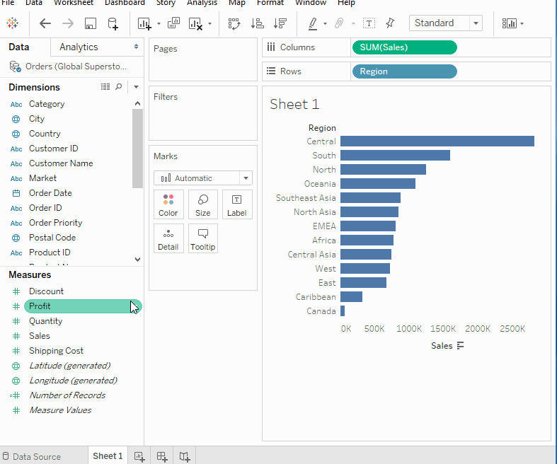
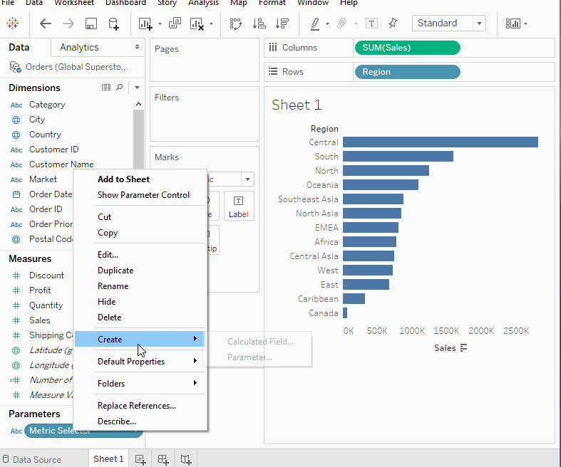
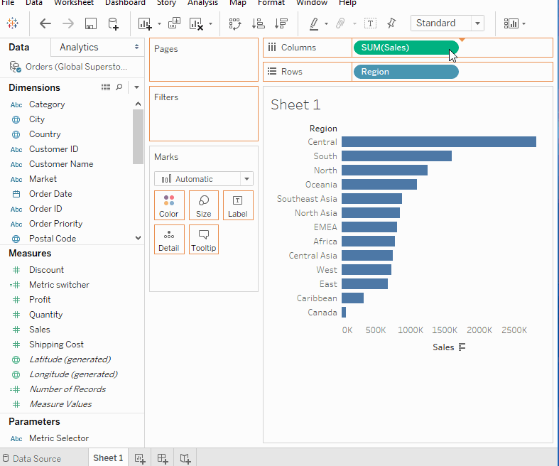
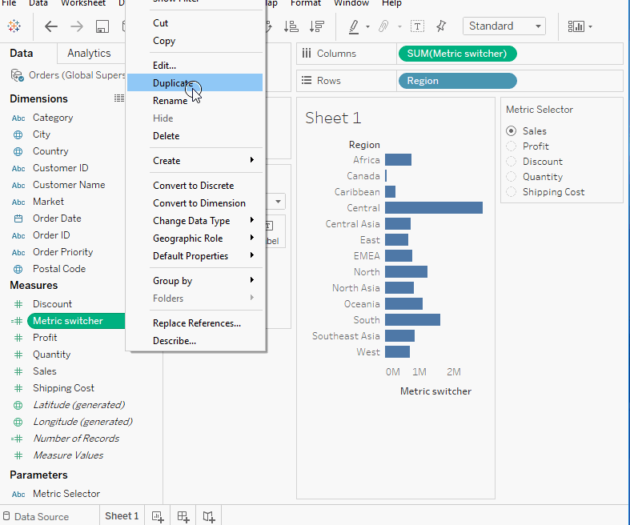
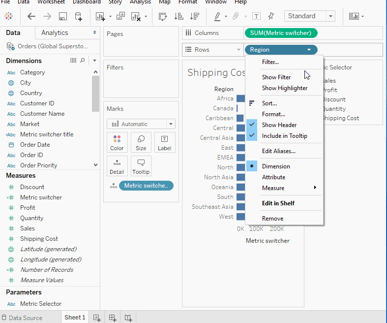
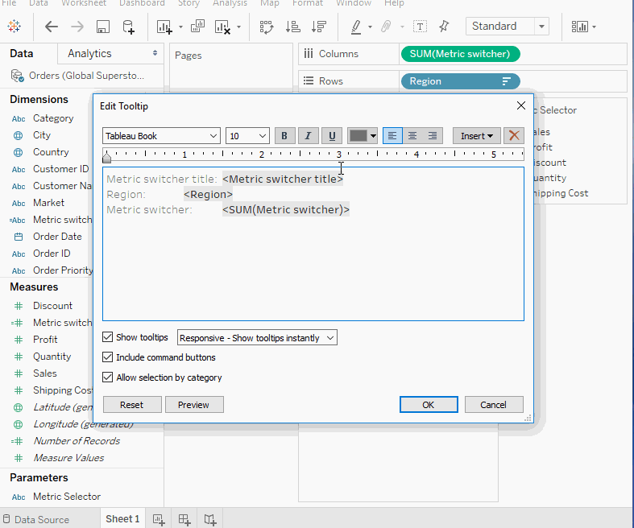

# Tableau Tips & Tricks: #5 Switching Measures with a Parameter

## Outline

## Use Cases

## Step 1 -

## Step 2 -

## Step 3 -

## Step 4 - 

## Step 5 - 

## Step 6 - 

## FAQs

Can I use the same method for dimensions?

Yes! :D

## Try it yourself!
Dashboard Link: 