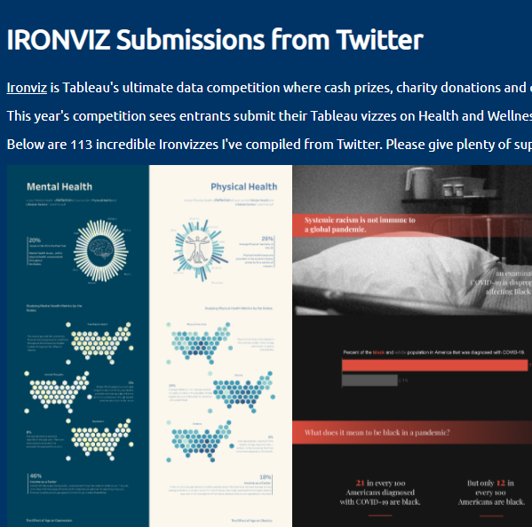

<!--img src='https:&#47;&#47;public.tableau.com&#47;static&#47;images&#47;We&#47;West4HarriersParkrunReport&#47;WeeklyParkrunReport&#47;1.png' -->

<!--div style="background-image:url('https:&#47;&#47;public.tableau.com&#47;static&#47;images&#47;We&#47;West4HarriersParkrunReport&#47;WeeklyParkrunReport&#47;1.png'); width:300px; height:300px;"></div-->

<!--img src='https:&#47;&#47;public.tableau.com&#47;static&#47;images&#47;Th&#47;TheMarathonTheHardPartBeginsAtMile20&#47;TheMarathonTheHardPartBeginsAtMile20&#47;1.png'-->