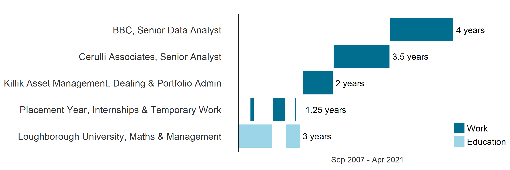
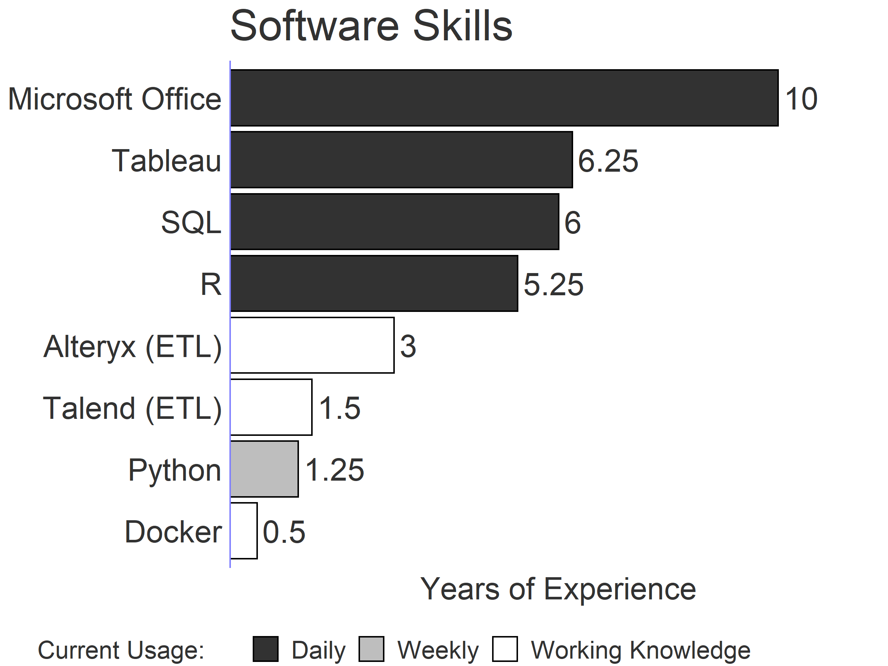

## WIILIAM JOE SUTTON IMC

I develop end-to-end solutions to problems with data. From the extraction of raw results to producing interactive dashboards to influence and inform business stakeholders.

#### Summary

- 6+ Years’ experience building interactive dashboards with Tableau, SQL (AWS Redshift), and R.
- 5+ Years’ building and maintaining ETL jobs in Alteryx, Talend, SQL and R.
- 2.1 Mathematics and Management (Hons) BSc from Loughborough University

### RELEVANT HIGHLIGHTS FROM WORK EXPERIENCE

---

#### Senior Data Analyst, BBC Customer Strategy & Insight

-   Responsible for producing and maintaining the Tableau reporting suite for the BBC Online services, related ETL workflows and relationships across teams
-   Designed, project managed and presented the division's COVID audience reaction dashboard 
-   Pioneered analysis work on the BBC's cross-media data source, identifying issues, developing what's possible and delivering insights back to senior managers, data specialists and product researchers
-   Skill sharing, host R, Python & SQL surgeries. Develop and mentor new analysts on all aspects of the job

#### Career Highlights

-   Developed the BBC's customer segmentation dashboard for identifying audiences we could shift to a more valued state, used as a workshop exercise for the top 100 BBC employees @ BBC Customer Strategy & Insight
-   Produced one chart that influenced Senior Managers not to embark on a poor ROI three-year project @ BBC Archives
-   Project managed the setup of a Twitter monitor working with a third-party vendor and internal resources, securing funding from CEO and mainboard, communicated project to the entire business at conference calls @ Cerulli Associates

#### Timeline of Education & Work Experience

Full details of work experience available at [https://www.linkedin.com/in/will-sutton-14711627](https://www.linkedin.com/in/will-sutton-14711627)

### SKILLS & COMPETENCES
---

Educational Qualifications

-	Tableau Desktop Certified Professional (Jan 2020)
-	Tableau Desktop Certified Associate (Jul 2018)
-	Investment Management Certificate (Apr 2013)
-	BSc Mathematics and Management (Hons) 2:1 (Loughborough University, 2011)
-	CeFA1 (2009)
  

### PORTFOLIO
---

[Tableau Public]:https://public.tableau.com/profile/will7508#!/
[Stack Overflow]:https://stackoverflow.com/users/8216789/wjs?tab=profile
[GitHub]:https://github.com/wjsutton
[Website]:https://wjsutton.github.io/

    
        Tableau Public
    
    
        <a href="https://public.tableau.com/profile/will7508#!/">https://public.tableau.com/profile/will7508#!/</a>
    

Over 40+ Tableau visualisations available on my profile, here are a few of my favourites.

---

    
        Website
    
    
        <a href="https://wjsutton.github.io/">https://wjsutton.github.io/</a>
    

A blog site I developed to document personal projects for my reference and the benefit of others. 

- [📰 Building an Animated Voronoi Chart in R](https://wjsutton.github.io/data-viz/2020/05/19/Building-Animated-Voronoi-Chart-In-R.html) Building an animated Voronoi chart to show controlled space in a football match, using R, ggplot2, ggvoronoi, ScreenToGif and ezgif.com.
- [📰 Passing the Tableau Desktop Certified Professional Qualification](https://wjsutton.github.io/data-viz/2020/04/10/The-Tableau-Professional-Certification.html) Tips and techniques I used to prepare for the Tableau Desktop Certified Professional Qualification

---

    
        Github
    
    
        <a href="https://github.com/wjsutton">https://github.com/wjsutton</a>
    

Personal Github account for personal projects and testing.

- [📘 parkrun_parser](https://github.com/wjsutton/parkrun_parser) Extract parkrun.org results from the consolidated club report pages for a weekly email to my running club.
- [📘 internet_speed_test](https://github.com/wjsutton/internet_speed_test) Monitoring and recording my home internet speed and visualising the results in a [dashboard 📈](https://public.tableau.com/profile/will7508#!/vizhome/MyHomeBroadband/MyHomeBroadband)
- [📘 ggplot2_snippets](https://github.com/wjsutton/ggplot2_snippets) R ggplot2 templates building from [https://www.r-graph-gallery.com/](https://www.r-graph-gallery.com/)

---

#### Awards & Achievements

- Tableau Viz of the Day [2020-08-05](https://public.tableau.com/en-us/gallery/2020-ironviz-tweets?tab=featured&type=featured)
- Committee Member: West 4 Harriers Running Club
- Finished Comrades Marathon 2017 (54 miles), UK Ironman 2015, 12 Marathons
- 50+ SQL questions answered on [Stack Overflow][Stack Overflow]
- Started UK office blood donation group (Cerulli)
- Competed in over 20 Triathlon Events at University Level
- Many Charity events including Palace to Palace Cycle Ride and Invesco Highlands

#### Interests

- Running
- Cross Country
- Triathlon 
- Rugby
