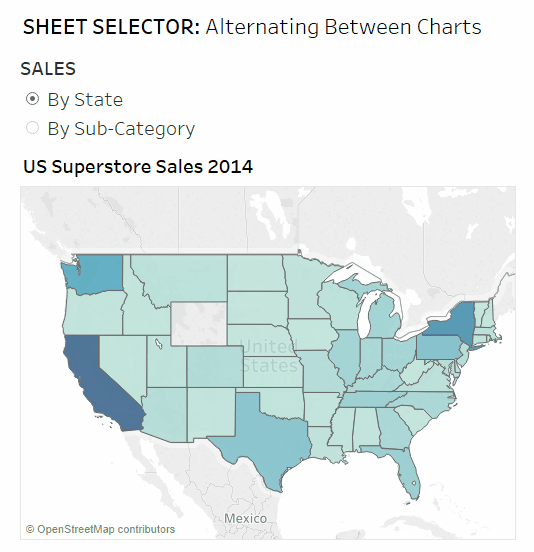
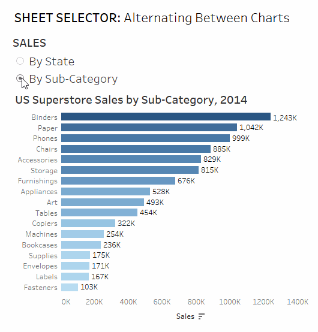
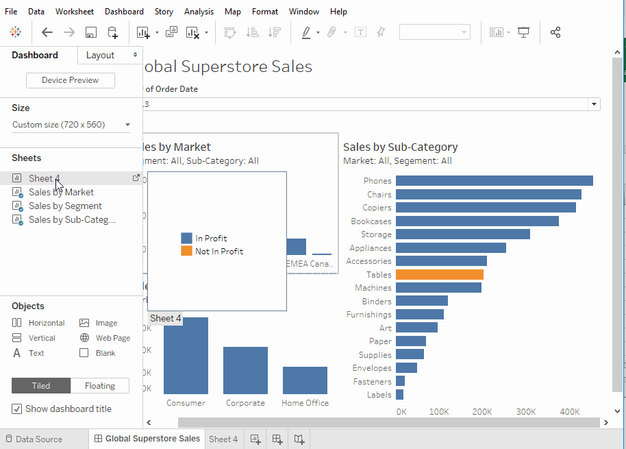
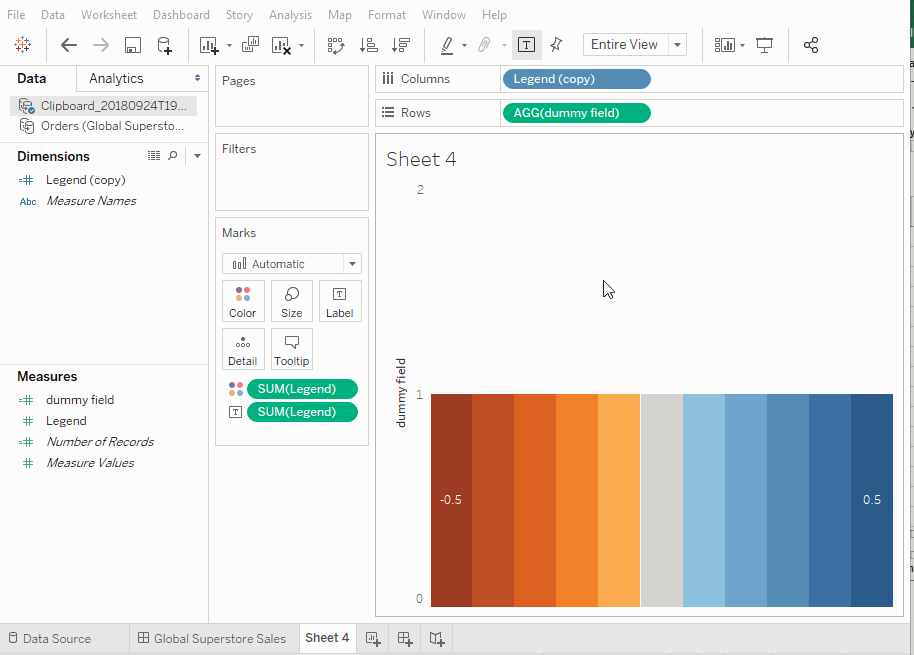

## Tableau Tips & Tricks 

Tableau is powerful data analysis and visualisation tool, you can find out more here: [www.tableau.com](https://www.tableau.com/)

To get the most out of the tool I've put together a few step by step tutorials I've put together for workarounds in Tableau. 

<h5>[Sheet Selectors](content\tableau_tips_and_tricks\Tableau-Tips-Tricks-1-Sheet-Selectors.html)</h5>
Charts are great, filters are great, sometimes the two together can leave a bit to be desired... So switch the bad chart for a different chart using a sheet selector!

<h5>[Title as a Sheet](content\tableau_tips_and_tricks\Tableau-Tips-Tricks-2-Title-as-a-Sheet.html)</h5>
Titles don't always work as intended, you can skip the headaches by creating a sheet to do the work for you.

<h5>[Custom Categorical Legend](content\tableau_tips_and_tricks\Tableau-Tips-Tricks-3-Custom-Categorical-Legend.html)</h5>
Want a legend that applies for the entire dashboard, not just the individual chart? - try this!

<h5>[Custom Sequential Legend](content\tableau_tips_and_tricks\Tableau-Tips-Tricks-4-Custom-Sequential-Legend.html)</h5>
Similarly you have a the same customisable legend can be sequential too with this method.

